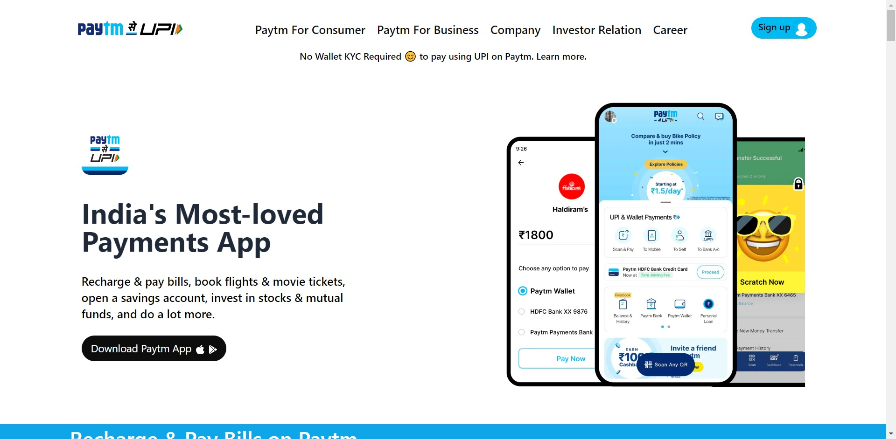

# Project 16 - HTML and Tailwind CSS

## Murtuza Rangwala

## What I learned from this Project?

- Learning Tailwind CSS and build the Paytm Clone

## Live Link of the Project:

[Live Project Link](https://mk-paytm.netlify.app/)

## Output:

